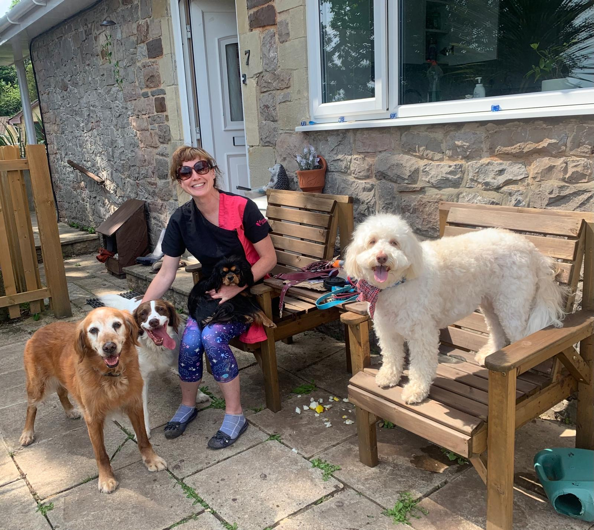

# About

Hi, I’m Karen, the heart and hands behind Karen’s Holistic Dog Grooming. My passion is creating a calm, gentle grooming experience where your dog feels safe, relaxed, and cared for every step of the way.

I believe grooming should never be stressful or frightening. That’s why I take the time to get to know each dog’s personality, using a patient, holistic approach that puts their comfort first. From soothing techniques to a peaceful environment, every detail is designed to make grooming a positive, tail‑wagging experience.

# Booking

You can book an appointment directly here



Call me on *****


